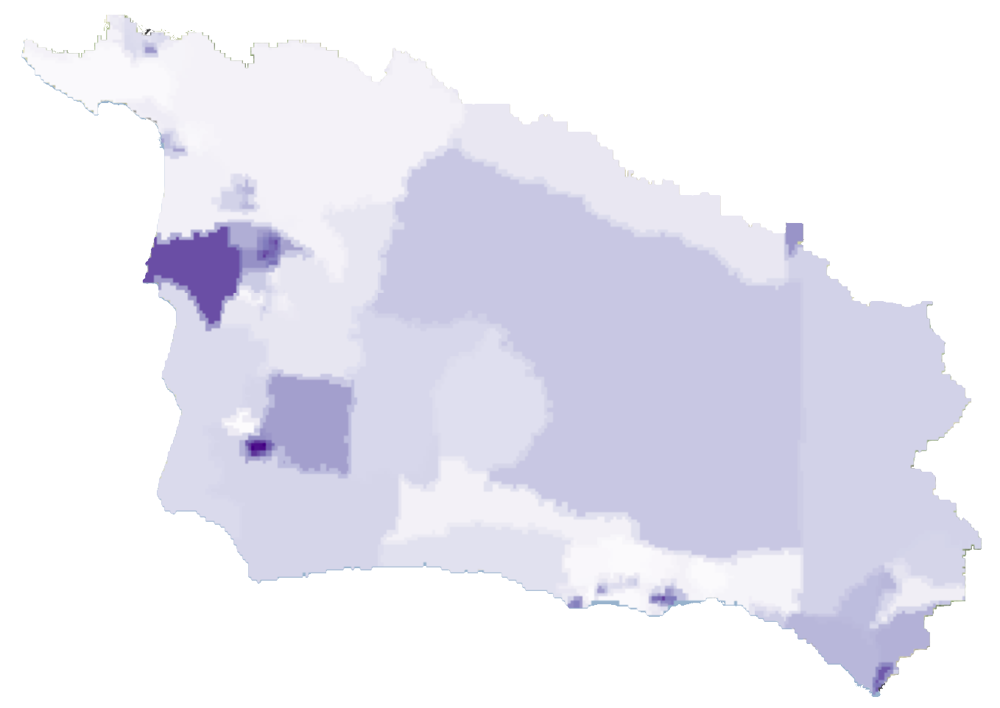
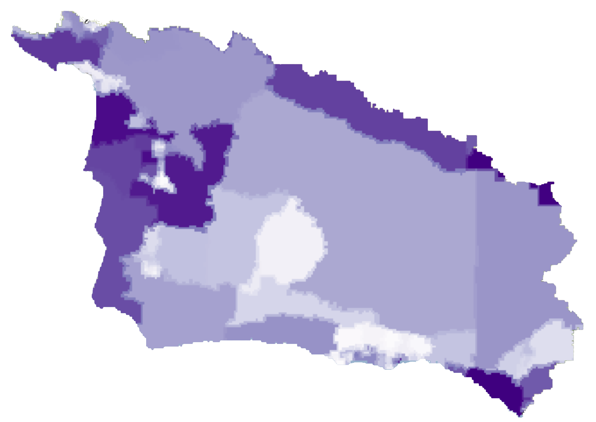
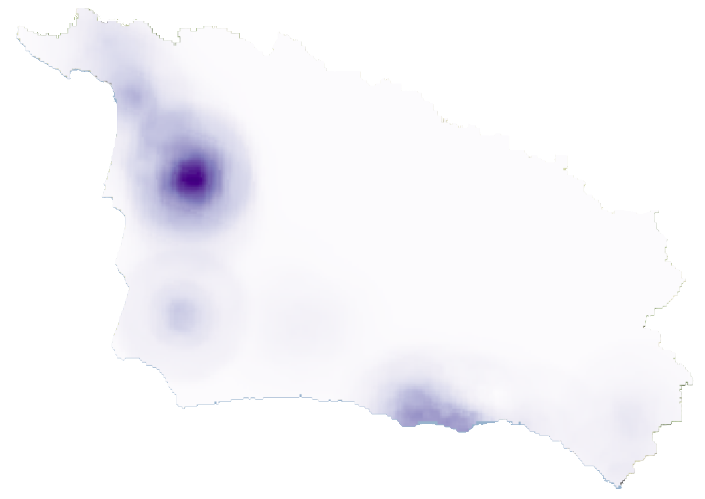

<style type="text/css">
  body{
  font-family: "Whitney A", "Whitney B", Whitney, "Trebuchet MS", sans-serif;
  background-color: rgb(236,240,245); 
}
</style>

```{r setup, include=FALSE, echo=FALSE}
knitr::opts_chunk$set(echo = TRUE, echo = FALSE)
library(htmltools)
```


<br>

<h2><mark style = "color:#ffffff;
                            background-color: #9760a8;
                            border-radius: 0px;
                            padding: 3px 10px;
                            font-weight: bold;
                            position:relative;
                            filter:url(#marker-shape);
                            width:100%;
                            height:1em;
                            left:-0.25em;
                            top:0.1em;
                            padding:0 0.25em;
                            font-family: 'Chronicle Text G2 A', 'Chronicle Text G2 B', 
                            'Chronicle Text G2', Georgia, sans-serif">Data information</mark></h2>

<br>
<h4 style="display: inline-block;">Demographics</h4>

```{r out.width='30%', out.extra='style="float:right; padding:10px;-webkit-filter: drop-shadow(1px 1px 1px #666666)"'}

```

This layer is from CalEnviroScreen 3.0 indicator map for population characteristics. The data represents demographic characteristics of populations that make them more vulnerable to pollution and other environmental harms, grouped into categories of physiological traits, health status, or community characteristics. The specific components of this dataset include asthma, cardiovascular disease, low birth weight, education, housing burden, linguistic isolation, poverty, and unemployment. 

You can access the original data here: 
[CalEnviroScreen 3.0, Pollution Burden, Percentile, 2017](https://sbcblueprint.databasin.org/datasets/77b443653446408fbe31aa9e86b6948d/)

<br>
<h4 style="display: inline-block;">Pollution</h4>

```{r out.width='30%', out.extra='style="float:right; padding:10px;-webkit-filter: drop-shadow(1px 1px 1px #666666)"'}

```

This layer is from CalEnviroScreen 3.0 indicator map for pollution burden. The data represents potential exposures to pollutants and exposures to the environments affected by those pollutants. The specific components of this dataset include ozone, PM2.5, diesel particulate matter, drinking water contaminants, pesticide use, toxic releases from facilities, traffic impacts, cleanup sites, groundwater threats, hazardous waste, impaired waters, solid waste sites. 

You can access the original data here: 
[CalEnviroScreen 3.0, Pollution Burden, Percentile, 2017](https://sbcblueprint.databasin.org/datasets/77b443653446408fbe31aa9e86b6948d/)


<br>
<h4 style="display: inline-block;">Isolation from Nature
</h4>

```{r out.width='30%', out.extra='style="float:right; padding:10px;-webkit-filter: drop-shadow(1px 1px 1px #666666)"'}

```

This layer comes from the Conservation Biology Institute’s underserved trail populations dataset. This dataset was created from a combination of trail scarcity and population density inputs. The trail scarcity dataset contains all trails mapped by Ray Ford,USFS for Los Padres, and all OHV trails by Owlshead. Population density was calculated using data from the US Census Bureau’s 2015 update. 

You can access the original data here: 
[Underserved Populations for Trail/Open Space Access](https://sbcblueprint.databasin.org/datasets/eb197ef158954edd936af070a524c782/)

