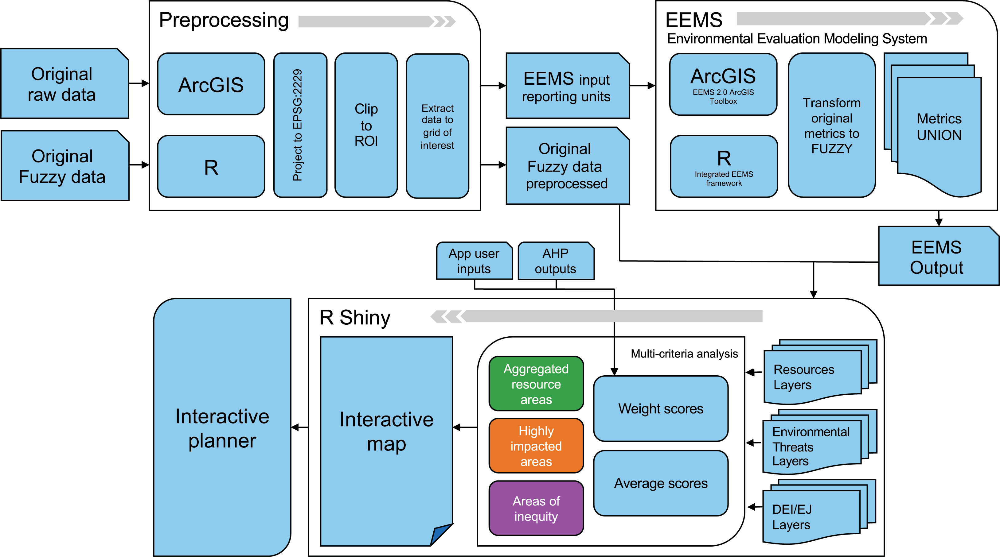

<style type="text/css">
  body{
  font-family: "Whitney A", "Whitney B", Whitney, "Trebuchet MS", sans-serif;
  background-color: rgb(236,240,245); 
}
</style>

```{r setup, include=FALSE, echo=FALSE}
knitr::opts_chunk$set(echo = TRUE, echo = FALSE)

library(htmltools)
```


<br>

<h2><mark style = "color:#ffffff;
                            background-color: #3e8ebd;
                            border-radius: 0px;
                            padding: 3px 10px;
                            font-weight: bold;
                            position:relative;
                            filter:url(#marker-shape);
                            width:100%;
                            height:1em;
                            left:-0.25em;
                            top:0.1em;
                            padding:0 0.25em;
                            font-family: 'Chronicle Text G2 A', 'Chronicle Text G2 B', 
                            'Chronicle Text G2', Georgia, sans-serif">Methodology</mark></h2>


<br>


Spatial data representing conservation values, environmental threats, and environmental justice indicators were processed using the Environmental Evaluation Modeling System (EEMS). Developed by Sheehan and Gough (2016), EEMS is a tree-based, fuzzy logic modeling framework for environmental decision support that allows one to combine data from different sources and numerical domains. This tool has been implemented in the ArcGIS ModelBuilder environment. The versatility of this framework allowed us to integrate metrics of different types and capture them in a single spatial layer with complex environmental outputs, such as multi-benefit areas. The Santa Barbara County region has several datasets based on this framework allowing us to build up our project based on Open Data practices. EEMS is used on web applications across California, and its results are available on several online repositories, including EEMS Online, Data Basin, and the Santa Barbara Blueprint. By using EEMS, we successfully produced 7 spatial layers out of the 11, which incorporated various metrics to delineate the environmental factors of interest for our targeted region. These layers were organized according to three main axes: natural resources, environmental threats, and DEI/EJ. The metrics employed to characterize each layer were derived from a review of commonly used measures found in the literature. The remaining layers were obtained from existing studies which contained data that fit within the three axes. The layers defining each axis are as follows:

- Natural resources: water resources, soil, biodiversity, and resilience.
- Environmental threats: droughts, flooding, wildfires, and climate exposure.
- Equity issues: pollution, isolation from nature, and demographics.
 
After integrating the conservation values into a uniform grid system for our region of interest and processing them with EEMS, we developed a Shiny application using R to display the results interactively. This web planner is designed to determine the extent of overlap between natural resources, natural hazards, and social values and to pinpoint areas that align with desired conservation objectives or environmental initiatives.

<br>
```{r echo=FALSE, fig.align='center', out.width="80%"}

```
<br>

*Figure 1. Diagram illustrating the workflow to create the interactive planner, including the three main steps of preprocessing, EEMS, and Shiny app creation.*


### Data sources

Environmental variables were collected from several open-source databases, including
Data Basin and Santa Barbara County Conservation Blueprint Atlas, and were developed by TNC, the Conservation Biology Institute (CBI), the Federal Emergency Management Agency (FEMA), and California Department of Water Resources (DWR). The layers representing biodiversity, water resources, climate resilience, climate exposure, and soil health were directly reused from existing works, while the rest (DEI/EJ, threats) were created based on metrics hosted in different repositories. 

We acquired data from various sources, such as the Conservation Biology Institute, FEMA, and the Department of Water Resources, to create our "threats" layers. The data included information pertaining to different climate projections available for our region of interest. Specifically, the droughts and flooding layers integrated data from the MIROC-esm RCP 8.5 and CCSM4 RCP 8.5 climate scenarios, while the wildfire layer consisted of the CNRM-CM5 and MIROC5 scenarios. Developments in the CNRM-CM5 model produce a more realistic representation of the mean recent climate (Voldoire et al., 2013). The CCSM 4 RCP 8.5 represents the Community Climate Modeling System version 4 with the highest emission scenarios going forward. Similarly, the MIROC-esm RCP8.5 utilizes many components to project a high emissions scenario for the future, serving as an effective tool for assessing potential physical climate risk (Schwalm et al., 2020). For ease in development, we kept the model information the same in our outputs as in the data we were provided. Within the interactive planner, users can assess the potential future threats to the region by toggling between the two climate scenarios available for droughts, flooding, and wildfire. Alternatively, they can choose to display the average values of both scenarios.

In the agricultural layer provided by Conservation Biology Institute, we decided to manipulate some of their aggregated metrics. Most of the stakeholders we interviewed for our project were focused on soil health metrics rather than actual agricultural or grazing land for cattle. For this reason, we removed the “grazing land” metric that was originally included in the layer to tailor our results to the responses of the stakeholders. 

### Preprocessing

The layers for the interactive planner were created by combining existing metrics from various spatial data sources. The original resolutions of most of these metrics were higher than the desired final resolution, which was reduced for two reasons: (1) with higher resolution (smaller pixel size), the computational requirements of the interactive planner would be too high, resulting in increased buffering time and slowed performance of the app. (2) To ensure accuracy and prevent data distortion, the resolution of the layers in the planner must be at least as high as the lowest resolution of any metric or layer included in the planner. Therefore, we chose a 2000 x 2000 foot (609.6 x 609.6 meters) cell size based on a previous work by the Conservation Biology Institute for similar areas of conservation interest in Santa Barbara (Brooking Gatewood et al., 2017). The extent of our area of interest was limited to the Santa Barbara County boundary. All layers were reprojected to EPSG:2229.
 
The EEMS is implemented in the ArcGIS ModelBuilder environment, which requires an input vector data file with a reporting unit feature for each metric. Therefore, we created a vector-based grid of regular square polygons clipped to our area of interest. Depending on the source data type format, we applied different methods to include information about the metric of interest in each cell. We used zonal statistics and NA interpolation for raster data to ensure overlap between the raster and grid layer. For vector data, we extracted the data using attribute joining by location. The preprocessing was done using QGIS 3.28 and ArcGIS 10.3, and later implemented in R for easy reproducibility (R version 4.1.2).

### Environmental Evaluation Modeling System

The available version of EEMS, EEMS 2.0 ArcGIS Toolbox, is only compatible with python 2.6 and can only be used with ArcGIS versions 10.1, 10.2, and 10.3. The data used in this tool was extracted from the pre-processed reporting unit file. A fuzzy conversion was applied to each metric, with values ranging from -1 to 1, indicating the lowest and highest representation of the attribute of interest, respectively. The range was set from 0 to 1 by implementing EEMS into R code posteriorly. When necessary, thresholds were set on the original data, and a simple linear interpolation was used to perform the conversion. Afterward, the metrics were combined into one final layer, with the choice of thresholds and union methods varying depending on the attribute and layer being created (Sheehan et al., 2016). 

The EEMS framework was converted into R code to improve reproducibility. The results were validated against the ones obtained from the EEMS 2.0 ArcGIS Toolbox. The integration of the EEMS framework into R is not comprehensive and is limited to the modeling aspects used in this study. However, despite this limitation, the use of a single coding format for all data processing streamlined the process and created a uniform pipeline, facilitating the creation of most of the layers.

### Shiny application

The creation of the interactive planner was based on Shiny. Shiny is an R package enabling interactive applications to execute R code on the backend. The first stage of implementing the planner was the preparation of the data inputs, which consisted of three vector data files, one for each of the planner’s axes — natural resources, environmental threats, and DEI/EJ issues — containing each of the scores from the EEMS outputs. The app's architecture consists of the read-in of specific attributes and their representation on a map using Leaflet, an open-source JavaScript library used to build web mapping applications, accessible through the respective R package. This package enables the map to be interactive, allowing users to zoom in and out and pan around the map, and toggle between different layers.
 
The planner has multiple tabs that allow users to interact with spatial information. The layers defining each axis can be represented individually or in an aggregated way by theme, where highly represented values correspond to a score of 1 and non-represented values to 0. The default aggregated assessment is based on average values, but the planner allows for flexibility in assessment generation. This is achieved by recalculating the aggregated values based on specific weights on a scale from 0 to 10, with which the user can interact. For instance, on the natural resources axis, users can display a multi-benefit conservation assessment and adjust the aggregated values according to their conservation priorities. Additionally, users can set predefined weights to represent priorities by organization type based on the AHP results. Furthermore, the planner includes interactive elements, such as buttons and drop-down menus, that allow users to control all the interactive options. These elements enable users to select areas of interest and generate summaries of the represented data, among other things.

Finally, the app underwent thorough testing and refinement to ensure that it was user-friendly and easy to navigate. A significant focus during the testing phase was enhancing the computational efficiency to decrease buffering times when recalculating the multi-benefit assessments and displaying the data.
