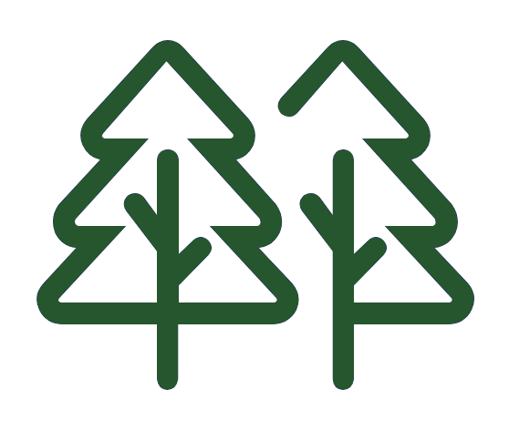

<style type="text/css">
  body{
  font-family: "Whitney A", "Whitney B", Whitney, "Trebuchet MS", sans-serif;
  background-color: rgb(236,240,245); 
}
</style>

```{r setup, include=FALSE, echo=FALSE}
knitr::opts_chunk$set(echo = TRUE, echo = FALSE)

library(htmltools)
```


<br>

<h2><mark style = "color:#ffffff;
                            background-color: #629871;
                            border-radius: 0px;
                            padding: 3px 10px;
                            font-weight: bold;
                            position:relative;
                            filter:url(#marker-shape);
                            width:100%;
                            height:1em;
                            left:-0.25em;
                            top:0.1em;
                            padding:0 0.25em;
                            font-family: 'Chronicle Text G2 A', 'Chronicle Text G2 B', 
                            'Chronicle Text G2', Georgia, sans-serif">Data information</mark></h2>


<br>
<h4 style="display: inline-block;">Biological significance</h4>

```{r out.width='30%', out.extra='style="float:right; padding:10px;-webkit-filter: drop-shadow(1px 1px 1px #666666)"'}

```

This layer corresponds to the Flora and Fauna Areas of Interest created by the Conservation Biology Institute for the Santa Barbara County Conservation Blueprint. The map highlights areas of interest for ecological resources by overlaying a variety of metrics related to fluvial systems, suitability for fauna, the existence of rare and endangered species, presence of protected vegetation, and connectivity.

You can access the original data here:
[Flora and Fauna "Areas of Interest"](https://sbcblueprint.databasin.org/datasets/b1e62c59d66b4f2f9ab0b9eb3f435843/)

<br>
<h4 style="display: inline-block;">Soil</h4>

```{r out.width='30%', out.extra='style="float:right; padding:10px; -webkit-filter: drop-shadow(1px 1px 1px #666666)"'}

```

This layer was adapted from the Agricultural Areas of Importance dataset originally created by the Conservation Biology Institute for the Santa Barbara County Conservation Blueprint. The original dataset highlights areas of interest for farming and ranching by overlaying a variety of metrics, including information on precipitation, grazing lands, soil characteristics, farmland, and feasible agricultural and ranch lands. Our layer differs slightly in that it does not include the grazing lands metric. We chose not to include grazing lands based on regional stakeholder responses regarding conservation priorities. Stakeholders and rightsholders in the area vocalized soil health in the context of crop agriculture rather than cattle and ranching.

You can access the original data here:
[Agricultural "Areas of Importance"](https://sbcblueprint.databasin.org/datasets/807abc2dc06a49b88e815751ffa8a75a/)

<br>
<h4 style="display: inline-block;">Water resources</h4>

```{r out.width='30%', out.extra='style="float:right; padding:10px;-webkit-filter: drop-shadow(1px 1px 1px #666666)"'}

```

This layer corresponds to the Water Resource Areas of Interest developed by the Conservation Biology Institute for the Santa Barbara County Conservation Blueprint. The map highlights areas of interest for water resources by overlaying a variety of inputs, including information on wetlands, waterways, groundwater, and watershed assessments.

You can access the original data here: 
[Water Resource "Areas of Interest"](https://sbcblueprint.databasin.org/datasets/fc3d91cbadf849d296e20a63ec2c2ac9/)


<br>
<h4 style="display: inline-block;">Resilience</h4>

```{r out.width='30%', out.extra='style="float:right; padding:10px;-webkit-filter: drop-shadow(1px 1px 1px #666666)"'}

```

This layer corresponds to the Resilient Sites dataset created by The Nature Conservancy. The map highlights areas throughout the region that are deemed likely to maintain species diversity and ecological function with the changing climate. The Nature Conservancy scored these sites by analyzing and evaluating the sites geophysical aspects like landscape diversity and connectedness.

You can access the original data here:
[Agricultural "Areas of Importance"](https://sbcblueprint.databasin.org/datasets/807abc2dc06a49b88e815751ffa8a75a/)

