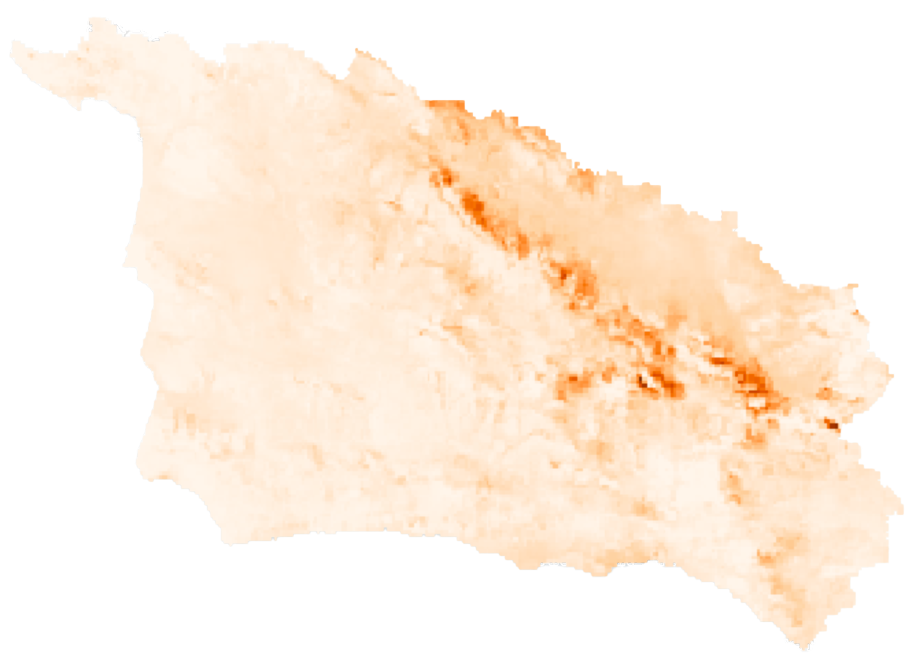
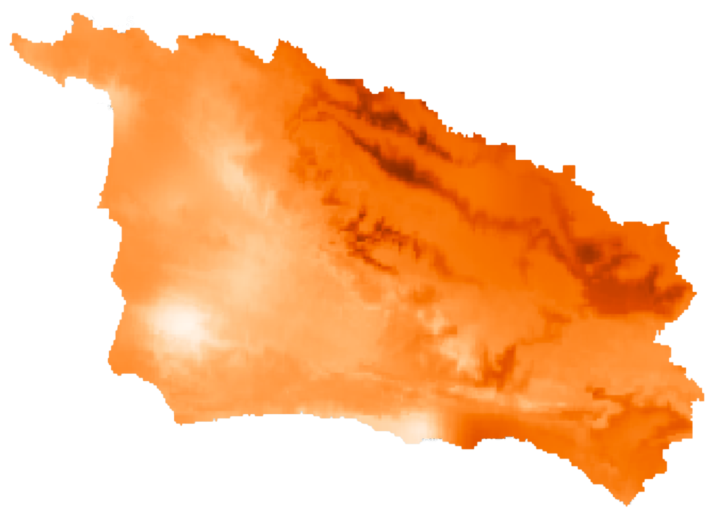
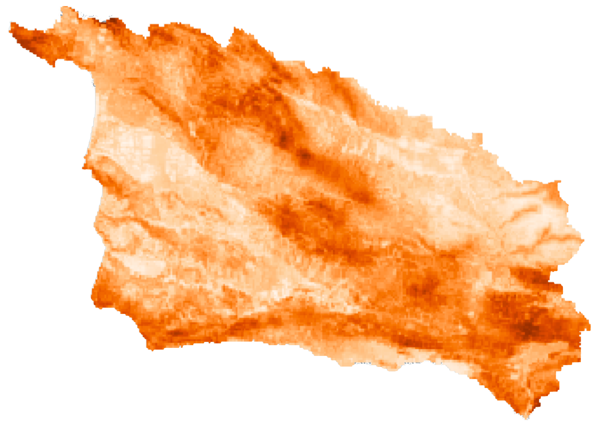
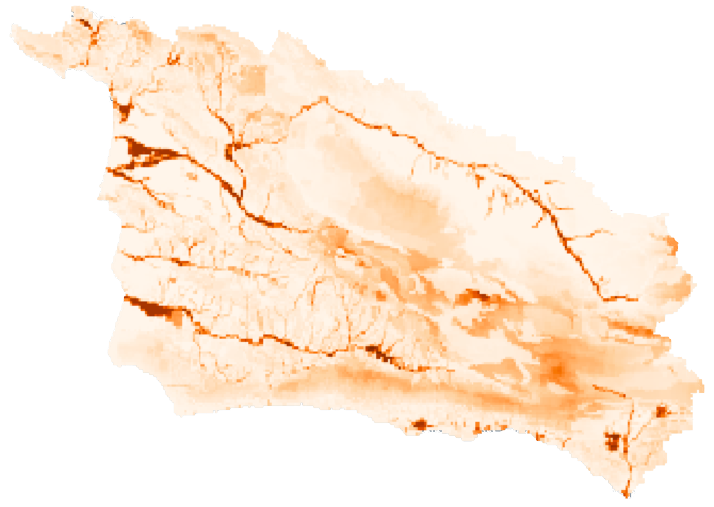

<style type="text/css">
  body{
  font-family: "Whitney A", "Whitney B", Whitney, "Trebuchet MS", sans-serif;
  background-color: rgb(236,240,245); 
}
</style>

```{r setup, include=FALSE, echo=FALSE}
knitr::opts_chunk$set(echo = TRUE, echo = FALSE)

library(htmltools)
```


<br>

<h2><mark style = "color:#ffffff;
                            background-color: #f78800;
                            border-radius: 0px;
                            padding: 3px 10px;
                            font-weight: bold;
                            position:relative;
                            filter:url(#marker-shape);
                            width:100%;
                            height:1em;
                            left:-0.25em;
                            top:0.1em;
                            padding:0 0.25em;
                            font-family: 'Chronicle Text G2 A', 'Chronicle Text G2 B', 
                            'Chronicle Text G2', Georgia, sans-serif">Data information</mark></h2>


<br>
<h4 style="display: inline-block;">Droughts</h4>

```{r out.width='30%', out.extra='style="float:right; padding:10px;-webkit-filter: drop-shadow(1px 1px 1px #666666)"'}

```

In order to illustrate the potential water stress in the region, we represent future droughts as a change in water availability. Rather than displaying future water projections, the layer will indicate areas where water will be more scarce in comparison to current levels. Therefore, water availability projections for 2010-2039 were compared to historical values (1981-2010). A value of zero or close to it represents a minimal change in water scarcity relative to present conditions, indicating that water availability will be similar to current levels. Increasing values characterize impacted regions that will experience greater water stress in the future. The layer was generated by combining data on projected changes in total precipitation, recharge and water deficit for two climate scenarios, CCSM4 RCP 8.5 and MIROC-esm RCP 8.5.

You can access the original data here: 
 [Projected change in total precipitation (2010-2039 vs. 1981-2010) MIROC-esm RCP 8.5](https://sbcblueprint.databasin.org/datasets/9be723a5818c43618aae7b51d11668a4/),
 [Projected change in total precipitation (2010-2039 vs. 1981-2010) CCSM4 RCP 8.5](https://sbcblueprint.databasin.org/datasets/7b135c02bf384393837f06860b36ab5d/),
 [Historical Recharge (1981-2010)](https://sbcblueprint.databasin.org/datasets/75600a604ae44878bacba076533e4f7e/), 
 [Recharge CCSM4 RCP 8.5 (2010-2039)](https://sbcblueprint.databasin.org/datasets/6518f608d7244f7992ad1a09584b9dda/), [Recharge MIROC-esm RCP 8.5 (2010-2039)](https://sbcblueprint.databasin.org/datasets/31294d9221e94836806538865796124a/), [Projected change in climatic water deficit (2010-2039 vs.1981-2010) CCSM4 RCP 8.5](https://sbcblueprint.databasin.org/datasets/15ae7cabe33541bdb4cceed6ddbcba48/),
 [Projected change in climatic water deficit (2010-2039 vs.1981-2010) MIROC-esm RCP 8.5](https://sbcblueprint.databasin.org/datasets/7ebf1297a12342038b32c71017c28c2b/)

<br>
<h4 style="display: inline-block;">Climate exposure</h4>

```{r out.width='30%', out.extra='style="float:right; padding:10px;-webkit-filter: drop-shadow(1px 1px 1px #666666)"'}

```

The Climate Exposure Layer was derived from the Climate Exposure Model developed by the Conservation Biology Institute. It represents the variability between the projected future climate (2016-2045) and the climate during a historical reference period. Higher climate exposure values indicate a more significant difference between the projected climate and past climate. The model incorporates aridity and climate, where climate factors include maximum and minimum temperatures, as well as precipitation on both seasonal and annual bases. Three climate futures projections were used along with the ensemble mean values from those models.

You can access the original data here:
[California Climate Exposure (Ensemble), 2016-2045](https://databasin.org/datasets/15e8a1a8ad604c2681590dc68d4ec1cf/)

<br>
<h4 style="display: inline-block;">Wildfires</h4>

```{r out.width='30%', out.extra='style="float:right; padding:10px;-webkit-filter: drop-shadow(1px 1px 1px #666666)"'}

```

Unlike drought stress and climate exposure, which are ongoing phenomena that change gradually over time, wildfires are derived sporadic events that occur under specific conditions. While the most concerning aspect of climate change and water scarcity is the long-term shift away from current conditions, the most concerning aspect of wildfires is their destructive potential regardless of past events. To avoid designating areas with low changes in fire probability but where current and future probabilities are high, we represented projected values instead of changes in projected values. This layer was created by combining the probabilities of future fire ignition and large fires occurrence based on two climate scenarios, CNRM-CM5 and MIROC5.

You can access the original data here:
 [Relative Probability of Fire Ignition CNRM-CM5 (2020-2050)](https://sbcblueprint.databasin.org/datasets/5f12c005061049e29b427f72e8faeeff/), [Relative Probability of Fire Ignition MIROC5 (2020-2050)](https://sbcblueprint.databasin.org/datasets/a92a5acc40854069af61de05e66dd440/), [Relative Probability of Large Fires CNRM-CM5 (2020-2050)](https://sbcblueprint.databasin.org/datasets/f7a96310bf0445288a6071b7068a62be/), [Relative Probability of Large Fires MIROC5 (2020-2050)](https://sbcblueprint.databasin.org/datasets/dc49e66ab48b4e49aa8f49a8402c545d/)

<br>
<h4 style="display: inline-block;">Floods</h4>

```{r out.width='30%', out.extra='style="float:right; padding:10px;-webkit-filter: drop-shadow(1px 1px 1px #666666)"'}

```

Flooding threats were assessed based on their occurrence rather than the changes in their occurrence. Our analysis includes flood risk areas classified by the Federal Emergency Management Agency (FEMA) and the California Department of Water Resources (DWR). Additionally, we examined runoff projections to determine where excess stormwater may not adequately infiltrate the soil, leading to flooding events. While flood risk areas indicate where water may accumulate excessively, runoff information provides insight into the areas from which excess water may originate and cause damage.

You can access the original data here:
 [Runoff MIROC-esm RCP 8.5 (2010-2039)](https://sbcblueprint.databasin.org/datasets/b6f38f39a6ce477191daf9a013244a4d/), [Runoff CCSM4 RCP 8.5 (2010-2039)](https://sbcblueprint.databasin.org/datasets/c442effdd6d94598b7e1da9111a4cf62/), [100-Year Flood Plain (FEMA)](https://sbcblueprint.databasin.org/datasets/403b34605a9c438f9fcd6c8a9ea6d3f6/), [500-Year Flood Plain (FEMA)](https://sbcblueprint.databasin.org/datasets/c55541cfbf8c4c4bb3897709db4eb75b/), 100-Year Flood Plain from [DWR](https://water.ca.gov/) is available upon request.

