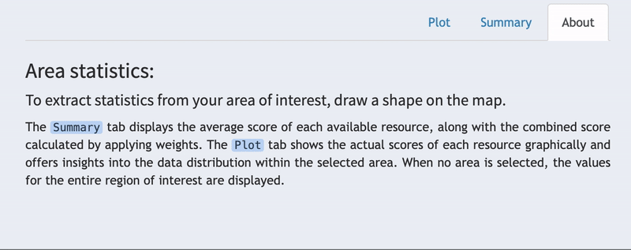

```{=html}
<style type="text/css">
  body{
  font-family: "Whitney A", "Whitney B", Whitney, "Trebuchet MS", sans-serif;
  background-color: rgb(255,255,255); 
}
</style>
```
```{r setup, include=FALSE, echo=FALSE}
knitr::opts_chunk$set(echo = TRUE, echo = FALSE)

library(htmltools)
```

```{r fig.align='center', out.width="70%", }

```

This section provides further details about the data displayed. By clicking [**in the "Summary" tab, you can view the average score of each available resource, along with the combined score**]{.underline} calculated by applying the weights. [**The "Plot" tab displays the actual scores of each resource and offers insights into its statistical distribution**]{.underline}. By default, [**when no area is selected, the values for the entire region of interest are displayed**]{.underline}.

In the next step of the tour, you will learn how to extract that information for specific areas.
